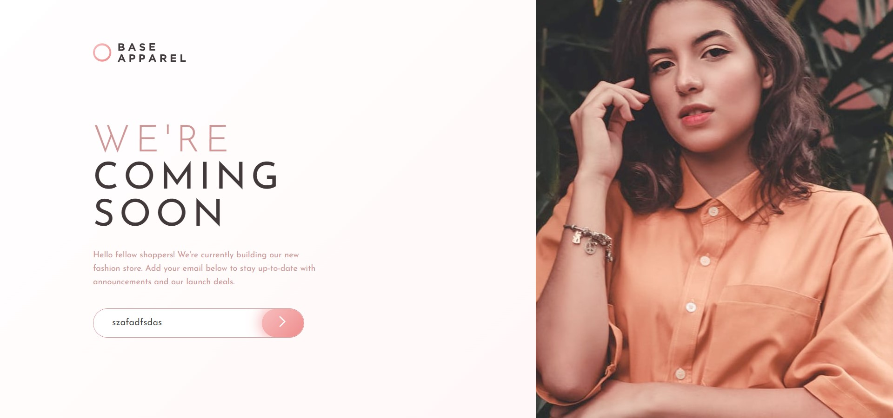

# Frontend Mentor - Base Apparel coming soon page solution

This is a solution to the [Base Apparel coming soon page challenge on Frontend Mentor](https://www.frontendmentor.io/challenges/base-apparel-coming-soon-page-5d46b47f8db8a7063f9331a0). Frontend Mentor challenges help you improve your coding skills by building realistic projects. 

## Table of contents

- [Overview](#overview)
  - [The challenge](#the-challenge)
  - [Screenshot](#screenshot)
  - [Links](#links)
- [My process](#my-process)
  - [Built with](#built-with)
- [Author](#author)

## Overview

### The challenge

Users should be able to:

- View the optimal layout depending on their device's screen size
- See hover states for interactive elements

### Screenshot

### Links

- Solution URL: [Link to solution](https://github.com/Captain-Subsurf/frontend-mentor-projects/tree/main/Base%20Apparel%20Coming%20Soon)
- Live Site URL: [Link to live site](https://base-apparel-coming-soon-subsurf.netlify.app/)

## My process

### Built with

- HTML5
- CSS 
- JavaScript
- Flexbox
- Media Queries
- Pseudo Elements

## Author

- Website - [Mohamed Farhan](https://subsurf.netlify.app)
- Frontend Mentor - [@Captain-Subsurf](https://www.frontendmentor.io/profile/Captain-Subsurf)
- Twitter - [@CaptainFarhan6](https://www.twitter.com/CaptainFarhan6)