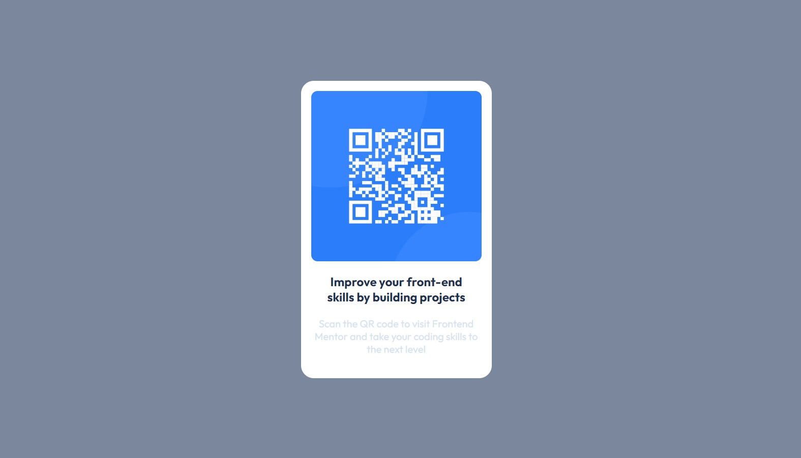

# Frontend Mentor - QR code component solution

This is a solution to the [QR code component challenge on Frontend Mentor](https://www.frontendmentor.io/challenges/qr-code-component-iux_sIO_H). Frontend Mentor challenges help you improve your coding skills by building realistic projects. 

## Table of contents

- [Overview](#overview)
  - [Screenshot](#screenshot)
  - [Links](#links)
- [My process](#my-process)
  - [Built with](#built-with)
- [Author](#author)

## Overview

### Screenshot

### Links
- Solution URL: [Link to the solution](https://github.com/Captain-Subsurf/frontend-mentor-projects/tree/main/QR%20Code%20Component)
- Live Site URL: [Link to the project](https://qr-code-card-subsurf.netlify.app/)

## My process

### Built with

- HTML5
- CSS
- Flexbox

## Author

- Website - [Mohamed Farhan](https://subsurf.netlify.app)
- Frontend Mentor - [@Captain-Subsurf](https://www.frontendmentor.io/profile/Captain-Subsurf)
- Twitter - [@yourusername](https://www.twitter.com/yourusername)
